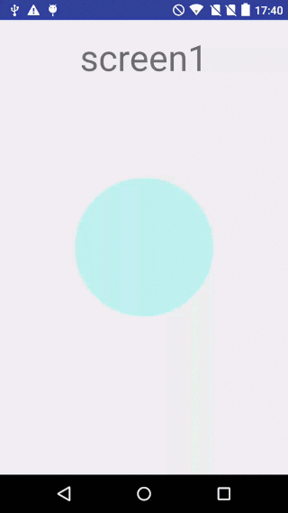

Shazam Choreographer example
======
Sample project implementing the Choreographer/Renderer architecture described in [Behind the scenes of the Shazam animation](link incoming). 
 
This project includes the following:
* The full LiteAnimator implementation
* Choreographer implementations
* Intra-activity "animation type" transitions (using TransitioningChoreographer)
* Cross-activity transitions for animated Views
* Renderer (as FunkyView)

---

[Download the APK](https://github.com/shazam/choreographer-example/blob/master/ShazamChoreographerExample.apk)